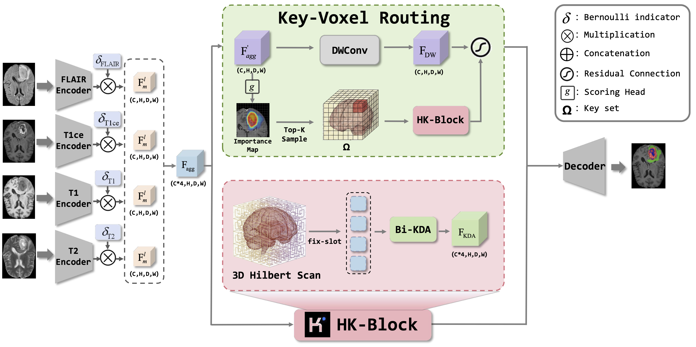

# HK-Fuse

**📄 Paper:** [HK-Fuse (MICCAI 2026)](https://papers.miccai.org/miccai-2026/paper/5288_paper.pdf)

HK-Fuse is an incomplete-modality brain tumor segmentation framework for multi-modal MRI. The model uses modality-specific encoders, intra-modal transformer attention, HK-Block based cross-modal fusion, KVR-based key-voxel skip fusion, and bottleneck inter-transformer refinement.

## Architecture

HK-Fuse combines modality-specific encoders, HK-Block-based cross-modal fusion, and Key-Voxel Routing (KVR) for skip-level fusion. The overall network architecture is illustrated below.



## Dataset and Experimental Setup

Following [IM-Fuse](https://github.com/AImageLab-zip/MiMoSe/tree/main/IMFuse), we adopt the same **dataset splits and missing-modality evaluation protocol** on the **BraTS 2023 GLI** dataset. The four MRI modalities are **FLAIR, T1ce, T1, and T2**. Model-specific training configurations are described in the Training section below.

| Split | Number of cases | File in this repository |
| --- | ---: | --- |
| Training | 875 | `datalist/train.txt` |
| Validation | 125 | `datalist/val15splits.csv` |
| Testing | 251 | `datalist/test15splits.csv` |

- **Modality order:** `[FLAIR, T1ce, T1, T2]`, as used in the preprocessing code.
- **Missing-modality setting:** All **15 non-empty combinations** of the four MRI modalities, from one available modality to all four. During training, an available-modality mask is randomly sampled for each case.
- **Evaluation:** Dice scores are reported for **Whole Tumor (WT)**, **Tumor Core (TC)**, and **Enhancing Tumor (ET)**.
- **Preprocessing:** The provided `preprocess.py` crops around the non-zero brain region, normalizes the images, and remaps segmentation label `4` to `3`.

## Requirements

The code was tested with Python 3.10, PyTorch 2.5.1, CUDA 12.1, and Triton 3.1.0.

Install PyTorch first according to your CUDA version. For CUDA 12.1:

```bash
pip install torch==2.5.1 torchvision==0.20.1 torchaudio==2.5.1 --index-url https://download.pytorch.org/whl/cu121
```

Then install the remaining dependencies:

```bash
pip install -r requirements.txt
```

HK-Fuse uses KDA from the bundled Flash Linear Attention package. Install it in editable mode:

```bash
pip install -e flash-linear-attention-main
```

Alternatively, expose the package through `PYTHONPATH`:

```bash
export PYTHONPATH=$PWD/flash-linear-attention-main:$PYTHONPATH
```

## Preprocess Data

Edit `src_path` and `tar_path` in `preprocess.py`:

- `src_path`: directory of the original BraTS cases
- `tar_path`: output directory for processed `.npy` files

Then run:

```bash
python preprocess.py
```

The script crops each case around the non-zero brain region, normalizes the four MRI modalities, remaps label `4` to `3`, and saves:

```text
<tar_path>/vol/*_vol.npy
<tar_path>/seg/*_seg.npy
```

## Training

Minimal training command:

```bash
python train.py \
  --datapath <PATH>/BRATS2023_Training_npy \
  --dataname BRATS2023 \
  --savepath <OUTPUT_PATH> \
  --kimi_skip
```

For the K200 setting used in our experiments, use TC-weighted Dice:

```bash
python train.py \
  --datapath <PATH>/BRATS2023_Training_npy \
  --dataname BRATS2023 \
  --savepath <OUTPUT_PATH> \
  --kimi_skip \
  --tc_dice_weight 1.5
```

Common optional arguments:

- `--resume <CHECKPOINT_PATH>`: resume training from a checkpoint
- `--wandb_mode disabled`: disable Weights & Biases logging
- `--disable_kvr`: disable KVR sparse skip updates
- `--kda_debug` or `--nan_debug`: enable numerical debugging tools


## Test

Run evaluation over all predefined missing-modality masks:

```bash
python test.py \
  --datapath <PATH>/BRATS2023_Training_npy \
  --savepath <OUTPUT_PATH> \
  --resume <CHECKPOINT_PATH> \
  --kimi_skip
```

The script writes per-mask metrics to:

```text
<OUTPUT_PATH>/metrics_K200_epoch<EPOCH>_rank<RANK>.txt
```

## Notes

- `--kimi_skip` enables the HK-Block/KVR skip-fusion path. The argument name is kept for checkpoint and command compatibility.
- `flash-linear-attention-main` is required because HK-Fuse imports `chunk_kda` from `fla.ops.kda`.
- If Flash Linear Attention fails to import, confirm that the package is installed with `pip install -e flash-linear-attention-main` or that its path is included in `PYTHONPATH`.
